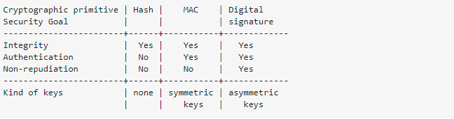

Hash VS Mac

Basically the main difference is MAC uses a private key and hash does not use any keys. Because of that MAC allows us to achieve authentication.As a result, hashes are used to guarantee the integrity of data, a MAC guarantees integrity AND authentication.

These types of cryptographic primitive can be distinguished by the security goals they fulfill:
Integrity:Can the recipient be confident that the message has not been accidentally modified?
Authentication:Can the recipient be confident that the message originates from the sender?
Non-repudiation:If the recipient passes the message and the proof to a third party, can the third party be confident that the message originated from the sender? (Please note that I am talking about non-repudiation in the cryptographic sense, not in the legal sense.) Also important is this question:
Keys:Does the primitive require a shared secret key, or public-private keypairs?I think the short answer is best explained with a table:

Please remember that authentication without confidence in the keys used is useless. For digital signatures, a recipient must be confident that the verification key actually belongs to the sender. For MACs, a recipient must be confident that the shared symmetric key has only been shared with the sender.

MAC: Message Authentication Code

ref:https://stackoverflow.com/questions/2836100/what-is-the-difference-between-a-hash-and-mac-message-authentication-code#:~:text=The%20main%20difference%20is%20conceptual,MAC%20guarantees%20integrity%20AND%20authentication.

