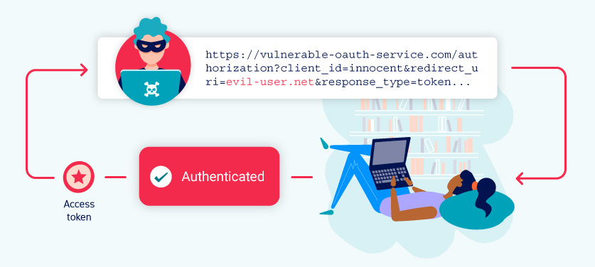

What is OAuth?

OAuth is a commonly used authorization framework that enables websites and web applications to request limited access to a user's account on another application. Crucially, OAuth allows the user to grant this access without exposing their login credentials to the requesting application. This means users can fine-tune which data they want to share rather than having to hand over full control of their account to a third party.

The basic OAuth process is widely used to integrate third-party functionality that requires access to certain data from a user's account. For example, an application might use OAuth to request access to your email contacts list so that it can suggest people to connect with. However, the same mechanism is also used to provide third-party authentication services, allowing users to log in with an account that they have with a different website.

How does OAuth 2.0 work?

OAuth 2.0 was originally developed as a way of sharing access to specific data between applications. It works by defining a series of interactions between three distinct parties, namely a client application, a resource owner, and the OAuth service provider.

    Client application - The website or web application that wants to access the user's data.
    Resource owner - The user whose data the client application wants to access.
    OAuth service provider - The website or application that controls the user's data and access to it. They support OAuth by providing an API for interacting with both an authorization server and a resource server.

There are numerous different ways that the actual OAuth process can be implemented. These are known as OAuth "flows" or "grant types". In this topic, we'll focus on the "authorization code" and "implicit" grant types as these are by far the most common. Broadly speaking, both of these grant types involve the following stages:

    The client application requests access to a subset of the user's data, specifying which grant type they want to use and what kind of access they want. The user is prompted to log in to the OAuth service and explicitly give their consent for the requested access. The client application receives a unique access token that proves they have permission from the user to access the requested data. Exactly how this happens varies significantly depending on the grant type. The client application uses this access token to make API calls fetching the relevant data from the resource server. 

OAuth authentication

Although not originally intended for this purpose, OAuth has evolved into a means of authenticating users as well. For example, you're probably familiar with the option many websites provide to log in using your existing social media account rather than having to register with the website in question. Whenever you see this option, there's a good chance it is built on OAuth 2.0.

For OAuth authentication mechanisms, the basic OAuth flows remain largely the same; the main difference is how the client application uses the data that it receives. From an end-user perspective, the result of OAuth authentication is something that broadly resembles SAML-based single sign-on (SSO). In these materials, we'll focus exclusively on vulnerabilities in this SSO-like use case.

OAuth authentication is generally implemented as follows:

    The user chooses the option to log in with their social media account. The client application then uses the social media site's OAuth service to request access to some data that it can use to identify the user. This could be the email address that is registered with their account, for example. After receiving an access token, the client application requests this data from the resource server, typically from a dedicated /userinfo endpoint. Once it has received the data, the client application uses it in place of a username to log the user in. The access token that it received from the authorization server is often used instead of a traditional password. 