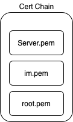
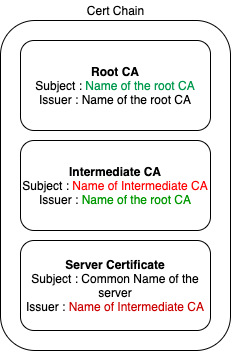

[TLS] Certificate Chain Validation

The SSL certificate chain order consists of root certificates, intermediate certificates, and the end-user certificate. An SSL certificate chain order is the list of intermediate CAs leading back to a trusted root CA. 
Root CAs are a trusted source of certificates.  Intermediate CAs are bridges that link the end-user certificate to the root CA. 


What is TLS certificate Chain?

An SSL certificate chain is the list of  certificates that contains the SSL certificate, intermediate certificate  authorities, and root certificate authority that enables the connecting  device to verify that the SSL certificate is trustworthy. This SSL  certificate chain begins with the SSL certificate and ends with the root  certificate. In this chain, the intermediate certificate is the issuer of the SSL  certificate and the root certificate is the issuer of the intermediate  certificate. The intermediate certificate must be installed on the same  server as the SSL certificate so that the connecting device (browsers,  applications, mobile device, etc.) can trust it.


How does SSL Certificate Chain Work?

In order for an SSL certificate to be authenticated by the web browsers, it must be authentic and be issued by a trusted certificate authority that’s embedded in the browser’s trusted store. If your SSL certificate isn’t issued by a trusted certificate authority, i.e., if it isn’t issued by a Root CA, then the connecting device or web browser will continue to check if the issuing CA was issued by a root CA. It will keep going back down the SSL certificate chain order to find the root CA. If it finds a root CA, a secure connection will be established. If it doesn’t find a root CA, then the connection will be dropped, and your web browser will display an error message that reads “invalid certificate” or “certificate not trusted.”


How to validate SSL Certificate Chain?

Let’s assume we have 3 certificates as below (I have used facebook’s cert chain for this example).
- server.pem is the server certificate file.
- im.pem is the intermediate certificate file.
- root.pem is the CA certificate file.



According to this, If we get the server.pem filesissuer, It should be the im.pem files subject. In this case.
```
user@Users-MBP cert % openssl x509 -noout -issuer -in server.pemissuer= /C=US/O=DigiCert Inc/OU=www.digicert.com/CN=DigiCert SHA2 High Assurance Server CAuser@Users-MBP cert % openssl x509 -noout -subject -in im.pemsubject= /C=US/O=DigiCert Inc/OU=www.digicert.com/CN=DigiCert SHA2 High Assurance Server CA
```

According  to this output, It seems like the issuer and subject matches  appropriately. We can use openssl verify command to verify this.
```
user@Users-MBP cert % openssl verify -untrusted im.pem server.pemserver.pem: OK# If wrong cert use user@Users-MBP cert % openssl verify -untrusted root.pem server.pemserver.pem: C = US, ST = California, L = Menlo Park, O = "Facebook, Inc.", CN = *.facebook.comerror 20 at 0 depth lookup:unable to get local issuer certificate
```

Like  that, We can verify adjacent certificate with openssl commands. Same  can apply to verify the CA and intermediate certificates.
```
user@Users-MBP cert % openssl verify -untrusted root.pem im.pemim.pem: OK
```

And also, You can certify the whole cert chain as fallows.
```
user@Users-MBP cert % openssl verify -CAfile root.pem -untrusted im.pem  server.pemserver.pem: OK
```


In a successful cert chain validation, issuers and subjects match according to the above diagram.


ref: https://shagihan.medium.com/what-is-certificate-chain-and-how-to-verify-them-be429a030887