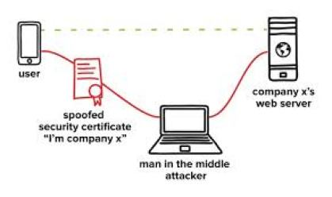

[TLS] What is certificate pinning?

Certificate pinning is the process of associating a host with their expected X.509 certificate or public key. Once a certificate or public  key is known or seen for a host, the certificate or public key is  associated or ‘pinned’ to the host.

A host or service’s certificate or public key can be added to an  application at development time, or it can be added upon first  encountering the certificate or public key. The former, adding at  development time, is preferred since preloading the certificate or  public key out of band usually means the attacker cannot taint the pin.  If the certificate or public key is added upon first encounter, this is  known as key continuity. Key continuity can fail if the attacker has a  privileged position during the first encounter.

Pinning leverages knowledge of the pre-existing relationship between  the user and an organization or service to help make better security  related decisions. Because the application already has information on  the server or service, it does not need to rely on generalised  mechanisms meant to solve the key distribution problem. That is, it does  not need to turn to DNS for name/address mappings or trusted CAs for bindings and status. No key distribution problems when there is no key  distribution!

Why should you always pin?

Mobile applications should utilize either certificate or public key  pinning in order to ensure that communications are secure. This is  usually implemented when the developer of the application needs to  validate the remote host’s identity or when operating in a hostile  environment. Since one or both of these are almost always true, it is  recommended that the majority of applications implement pinning.

Where and what to pin?

Certificate pinning can be implemented in a great many different  ways. The pinning strategy should be carefully designed as there are  many trade-offs to consider:
- What to pin? 
	- Certificate
	- Public key
	- Hash
- Where to pin? 
	- The server’s certificate (a.k.a. leaf certificate)
	- The Certificate Authority’s certificate (a.k.a. root certificate)
	- An intermediate certificate
	- The whole certificate chain
These decisions will affect the security but also the longevity of  the solution. For example, pinning connections against the whole  certificate chain will be the more robust strategy, but if any of the  certificates in the chain change (for legitimate reasons) then the  application will be unable to establish connections without users  updating to a newer/rectified version. As another example, if the  application pins connections against the leaf certificate’s public key,  connections will remain securely pinned even if the CA is compromised.

Where to pin?

Leaf certificate

- Guarantees with close to 100% certainty that this is your certificate 
	- even if Root CA was compromised
- If the certificate becomes invalid for some reason (either normal  expiration or compromise) the app will be bricked until you can push an  update out
- Allows self-signed certificates – which can be a good thing from an ease of maintenance perspective

Root certificate

- By pinning against the root certificate you are trusting the root  certificate authority as well as any intermediaries they trust not to  mis-issue certificates
- If CA gets compromised it’s game over
- Very important to maintain strong certificate validation 
	- Pinning is not an excuse for bad certificate validation!

Intermediate certificate:

- By pinning against an intermediate certificate you are trusting that  the intermediate certificate authority to not mis-issue a certificate  for your server(s)
- As long as you stick to the same certificate provider then any  changes to your leaf certificates will work without having to update  your app

What to pin?

Certificate

- Normally the certificate is easiest to pin
- At runtime, you retrieve the website or server’s certificate
- You compare the retrieved certificate with the certificate embedded within the application
- If the site/service rotates its certificate on a regular basis, then your application would need to be updated regularly

Public key

- More flexible
- A little trickier due to the extra steps necessary to extract the public key from a certificate 
	- Its harder to work with keys since you must extract the key from the certificate – can be somewhat of a pain in Cocoa/CocoaTouch and OpenSSL.
- As with a certificate, the program checks the extracted public key with its embedded copy of the public key

Hash

- Allows you to anonymize a certificate or public key 
	- this might be important if you application is concerned about leaking information during decompilation and reverse engineering
- A digested certificate fingerprint is often available as a native API for many libraries, so its convenient to use
- An organization might want to supply a reserve identity in case the primary identity is compromised
As these examples show, there are different implications that should be considered when implementing certificate pinning.

How should you pin?

From a technical perspective, it is not recommended that the pinned  certificates are loaded from the filesystem as it unnecessarily extends  the attack surface. It is recommended that the certificate, its public  key or a secure hash of it are embedded into the application, paired  with strong obfuscation and tamper detection mechanisms. Note that TLS  certificate pinning without effective jailbreak/root detection and other  advanced binary/runtime protections is a moot point: when the  application runs on a jailbroken/rooted device, root will be able to  instrument the application and bypass the pinning controls. The stronger  the controls of your application, the more time and skill will be  required from the adversary.

iOS

One of the most common ways of implementing certificate pinning for an iOS application, is to implement the didReceiveAuthenticationChallenge method in the NSURLConnectionDelegate. The custom certificate checks can be performed within the didReceiveAuthenticationChallenge method. Note that certificate validation should still be performed throughout the chain, which can be achieved by invoking SecTrustEvaluate in the delegate, before the custom certificate checks.
 Further ways of implementing certificate pinning – namely using the AFNetworking and AlamoFire frameworks – are covered in [2].

Android

In Android, the most common ways of implementing certificate pinning are usually:
1. by creating a new class that extends X509TrustManager and implementing the bespoke certificate checks in the checkServerTrusted method; or
2. by creating an empty KeyStore, adding the relevant certificates to it, and then: 
	1. initializing a TrustManagerFactory with this KeyStore;
	2. initializing the SSLContext with this TrustManagerFactory.
A multitude of frameworks exist in Android, which allow developers to  implement certificate pinning. Some of the most common ones are covered  in [3]. This includes Android N’s (and above) Network Security Configuration. Network Security Configuration.
Through a simple entry in the AndroidManifest.xml file the  developer specifies an XML configuration file that defines the pins  required. In fact, this solution works much better than previous  solutions for pinning WebViews’ connections – with no  additional effort on the developer’s part. It is also easy to support  self-signed certificates or certificate authorities that are not trusted  system root certificates.
However, both in iOS and Android platforms, there is a multitude of  ways certificate pinning can be hardened. For example, using OpenSSL  as a static library compiled with the app and using it for all  connections would significantly increase the complexity for an attacker  trying to instrument the application and bypass the pinning controls.

ref: https://labs.nettitude.com/tutorials/tls-certificate-pinning-101/