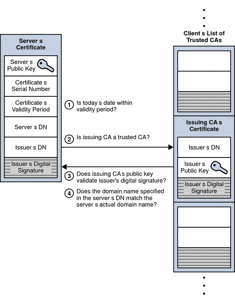

[TLS] Server Authentication During SSL Handshake

SSL-enabled client software always requires server authentication, or cryptographic validation by a client of the server’s identity. The server sends the client a certificate to authenticate itself. The client uses the certificate to authenticate the identity the certificate claims to represent.
To authenticate the binding between a public key and the server identified by the certificate that contains the public key, an SSL-enabled client must receive a yes answer to the four questions shown in the following figure.

An SSL-enabled client goes through the following steps to authenticate a server’s identity:
1. Is today’s date within the validity period?
   The client checks the server certificate’s validity period. If the current date and time are outside of that range, the authentication process won’t go any further. If the current date and time are within the certificate’s validity period, the client goes on to  the next step.
2. Is the issuing CA a trusted CA?
   Each SSL-enabled client maintains a list of trusted CA certificates, represented by the shaded area on the right—hand side of  Figure 2–9. This list determines which server certificates the client accepts. If the distinguished name (DN) of the issuing CA matches the DN of a CA on the client’s list of trusted CAs, the answer to this question is yes, and the client goes on to the next step. If the issuing CA is not on the list, the server is not authenticated unless the client can verify a certificate chain ending in a CA that is on the list.
3. Does the issuing CA’s public key validate the issuer’s digital signature?
   The client uses the public key from the CA’s certificate (which is found in its list of trusted CAs in step 2) to validate the CA’s digital signature on the server certificate being presented. If the information in the server certificate has changed since it was signed by the CA or if the CA certificate’s public key doesn’t correspond to the private key used by the CA to sign the server certificate, the client won’t authenticate the server’s identity. If the CA’s digital signature can be validated, the server treats the user’s certificate as a valid “letter of introduction” from that CA and proceeds. At this point, the client has determined that the server certificate is valid.
4. Does the domain name in the server’s certificate match the domain name of the server itself?
   This step confirms that the server is actually located at the same network address specified by the domain name in the server certificate. Although step 4 is not technically part of the SSL protocol, it provides the only protection against a form of security attack known as man-in-the-middle. Clients must perform this step and must refuse to authenticate the server or establish a connection if the domain names don’t match. If the server’s actual domain name matches the domain name in the server certificate, the client goes on to  the next step.
5. The server is authenticated.
   The client proceeds with the SSL handshake. If the client doesn’t get to step 5 for any reason, the server identified by the certificate cannot be authenticated, and the user is warned of the problem and informed that an encrypted and authenticated connection cannot be established. If the server requires client authentication, the server performs the steps described in Client Authentication During SSL Handshake.
After the steps described here, the server must successfully use its private key to decrypt the pre-master secret sent by the client.

https://docs.oracle.com/cd/E19693-01/819-0997/aakhc/index.html
