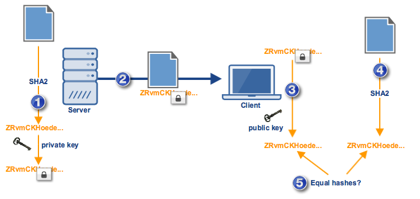

Digital signatures are a tool that is used to help enforce security during data transfers. Learn how they're used, how they work, and why they're integral.

Overview

Digital signatures help enforce security during data transfers.  They're mainly responsible for establishing authentication, data  integrity, and non-repudiation. Today, we'll be talking about the basic  concepts behind digital signatures, where they're used, how they work,  and why they're always an integral part of highly secure file transfers.

Uses of digital signatures

Digital signatures are used to meet three important goals of  information security: integrity, authentication, and non-repudiation.

Data integrity

Message or Data integrity is particularly crucial during data  transfers. Data integrity ensures that the message received by the  recipient is exactly the same message sent by the sender. In wide area networks like the Internet, where messages have to hop from one node or  network device to another before arriving at their intended final  destination, there's always that risk of messages getting altered along  the way whether deliberately or accidentally. Data integrity mechanisms  help mitigate those risks. Through a data integrity check, you'll know if the message you received has been tampered.

Authentication

When you receive a sensitive file, it's sometimes not enough to know  that the information in that file has been unaltered. You would also want to be sure whether it really came from the person who you think  sent it. In other words, you would need a mechanism that would enable  you to authenticate the source.
For example, let's say you received a list of your top managers  accompanied by a request for their corresponding salaries. It would be  wise to authenticate the source of that request first before sending out  an appropriate response. You wouldn't want to be sending out that  information to unauthorized personnel or to a competitor.

Non-repudiation

Lastly, there may be data exchanges where you wouldn't want senders  to disown transmissions they actually sent some time in the past. For  example, if someone submits a report and the report is later found to be  fraudulent, you wouldn't want the sender to deny the fact that he sent it.

So how do digital signatures help you achieve these information  security goals? Perhaps it would be best to start by explaining how they work.

How digital signatures work

Cryptographic digital signatures make use of asymmetric encryption  keys, i.e. public keys and their corresponding private keys (a.k.a.  secret keys). The private key is used to create a digital signature (in  other words, for "signing"), while the public encryption key is used for verifying the digital signature. What makes this work is the fact that a  pair of public and private keys are so closely linked with one another  that it would be virtually impossible for a public key to authenticate a  signature generated by a private key that it isn't associated with.

So how does one create a digital signature?
To create a digital signature, you would take the message or file you would like to sign and run it through a hash function.  After that, you take the resulting message digest or hash, combine it with your private key, and then run them through a signing algorithm  like RSA or DSA. The final result is that message's digital signature. Of course, in applications like a secure file transfer server, these things happen behind the scenes.
Theoretically, you could skip that hash function part and simply run  the file and the private key through some "signing algorithm" and still  produce a "digital signature". However, if the file is so large, this  would take a great deal of time. Besides, the resulting "signature"  would also consume an impractically huge amount of space.

How about the digital signature verification process? 
This process  now involves the secret key's public key pair. While the secret key is  used to sign documents, its corresponding public key is used for verifying their authenticity. Remember when I told you that the public key is tightly linked to its private key?
If you have a public key and the key fails to authenticate a document  you just received, that would mean the secret key used for signing  wasn't this public key's pair. Consequently, it would also mean that the  document's source isn't who you expected it to be. That's how digital  signatures are used for authentication.
During the same verification process, the public key is also used to  extract the message digest that was originally combined with the private  key to produce the digital signature. The retrieved message digest is  then compared with the recipient's own locally-generated hash value of  the received message. The recipient must know what hash function was  used by the sender. If the locally-generated hash value and the  extracted message digest are equal, then it would mean that integrity of  the message has been preserved.

Let me just go over those steps:
1. At the source (in this case, a server), the document is run through a hash function (e.g. SHA2 hashing algorithm) to produce a hash a.k.a. message digest. The message digest is combined with the source's private key to produce the document's digital signature.
2. The digital signature is affixed to the document and both are sent to the recipient (in this case, a client application).
3. At the client side, the message digest is extracted from the digital signature using a copy of the server's public key that's in the client's possession. Note that the client wouldn't be able to extract the message digest if the public key in its possession doesn't match the private key used to generate the digital signature.
4. The client runs the document through the same hash function used by the sender to produce its own locally-generated hash.
5. The two hashes are compared.
If the two hashes are equal, it would prove two things: 1. that the document was unaltered (thereby achieving integrity) and 2. that the source is who the recipient expected it to be (thereby achieving  authentication).
If both are achieved, then there is no way the sender can later on  deny that he sent the document. That's because none of these would be achieved if the wrong private key was used in step 1. Since only the  source could (theoretically) have a hold of the private key, only the  source could have initiated this particular transaction. And that is how digital signatures help establish non-repudiation.
Its ability to help enforce authentication, data integrity, and  non-repudiation can be very useful in automated business transactions  and is the reason why digital signatures are integral to secure data  transfer protocols like SFTP, FTPS, OFTP, and AS2.

When digital signatures alone are not enough

Notice how digital signatures are very dependent on the integrity of  the encryption keys. What if the public key in your possession actually  belongs to an impostor? It's possible for an attacker to pose as someone  else and then dupe you into obtaining his (the attacker's) public key.  Once that happens, the entire process illustrated earlier (from step 1  through 5) will proceed as normal even if (in actuality) it has already  been compromised.

From: https://www.jscape.com/blog/what-is-a-digital-signature
