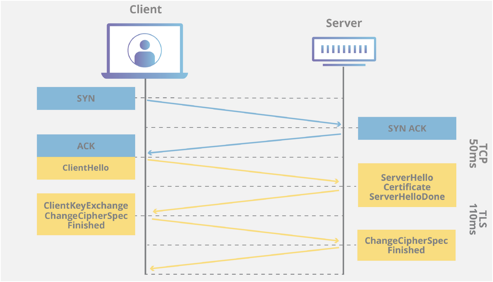

SSL Handshake

The SSL protocol uses a combination of public-key and symmetric key encryption. Symmetric key encryption is much faster than public-key encryption, but public-key encryption provides better authentication techniques. An SSL session always begins with an exchange of messages called the SSL handshake. The handshake allows the server to authenticate itself to the client by using public-key techniques, and then allows the client and the server to cooperate in the creation of symmetric keys used for rapid encryption, decryption, and tamper detection. Optionally, the handshake also allows the client to authenticate itself to the server.

Messages Exchanged During SSL Handshake

The following steps describe the sequence of messages exchanged during an SSL handshake. 
1. The client sends the server the client’s SSL version number, cipher settings, randomly generated data, and other information the server needs to communicate with the client using SSL.
2. The server sends the client the server’s SSL version number, cipher settings, randomly generated data, and other information the client needs to communicate with the server over SSL. The server also sends its own certificate and, if the client is requesting a server resource that requires client authentication, requests the client’s certificate.
3. The client uses some of the information sent by the server to authenticate the server. For details, see Server Authentication During SSL Handshake. If the server cannot be authenticated, the user is warned of the problem and informed that an encrypted and authenticated connection cannot be established. If the server can be successfully authenticated, the client goes on to Step 4.
4. Using all data generated in the handshake so far, the client, with the cooperation of the server, depending on the cipher being used, creates the pre-master secret for the session, encrypts it with the server’s public key, obtained from the server’s certificate in Step 2, and sends the encrypted pre-master secret to the server.
5. If the server has requested client authentication (an optional step in the handshake), the client also signs another piece of data that is unique to this handshake and known by both the client and server. In this case, the client sends both the signed data and the client’s own certificate to the server along with the encrypted pre-master secret.
6. If the server has requested client authentication, the server attempts to authenticate the client. For details, see Server Authentication During SSL Handshake. If the client cannot be authenticated, the session is terminated. If the client can be successfully authenticated, the server uses its private key to decrypt the pre-master secret, then performs a series of steps (which the client also performs, starting from the same pre-master secret) to generate the master secret.
7. Both the client and the server use the master secret to generate the session keys, which are symmetric keys used to encrypt and decrypt information exchanged during the SSL session and to verify its integrity—that is, to detect changes in the data between the time it was sent and the time it is received over the SSL connection.
8. The client sends a message to the server informing it that future messages from the client are encrypted with the session key. It then sends a separate (encrypted) message indicating that the client portion of the handshake is finished.
9. The server sends a message to the client informing it that future messages from the server are encrypted with the session key. It then sends a separate (encrypted) message indicating that the server portion of the handshake is finished.
10. The SSL handshake is now complete, and the SSL session has begun. The client and the server use the session key to encrypt and decrypt the data they send to each other and to validate its integrity.

Before continuing with a session, directory servers can be configured to check that the client’s certificate is present in the user’s entry in an LDAP directory. This configuration option provides one way of ensuring that the client’s certificate has not been revoked.
Both client and server authentication involve encrypting some piece of data with one key of a public-private key pair and decrypting it with the other key:
- In the case of server authentication, the client encrypts the pre-master secret with the server’s public key. Only the corresponding private key can correctly decrypt the secret, so the client has some assurance that the identity associated with the public key is in fact the server with which the client is connected. Otherwise, the server cannot decrypt the pre-master secret and cannot generate the symmetric keys required for the session, and the session is terminated.
- In the case of client authentication, the client encrypts some random data with the client’s private key—that is, it creates a digital signature. The public key in the client’s certificate can correctly validate the digital signature only if the corresponding private key was used. Otherwise, the server cannot validate the digital signature and the session is terminated.

From: https://docs.oracle.com/cd/E19693-01/819-0997/gbfqu/index.html
